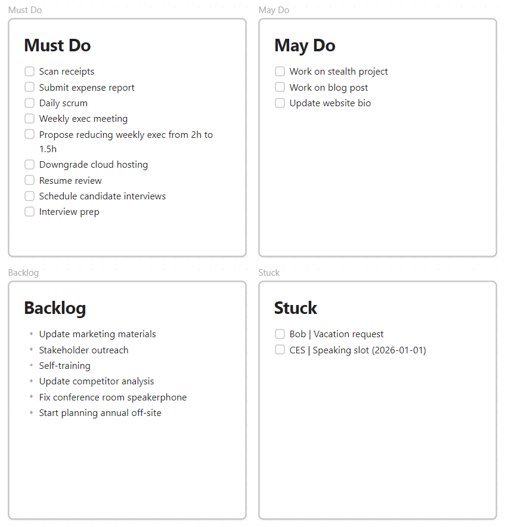
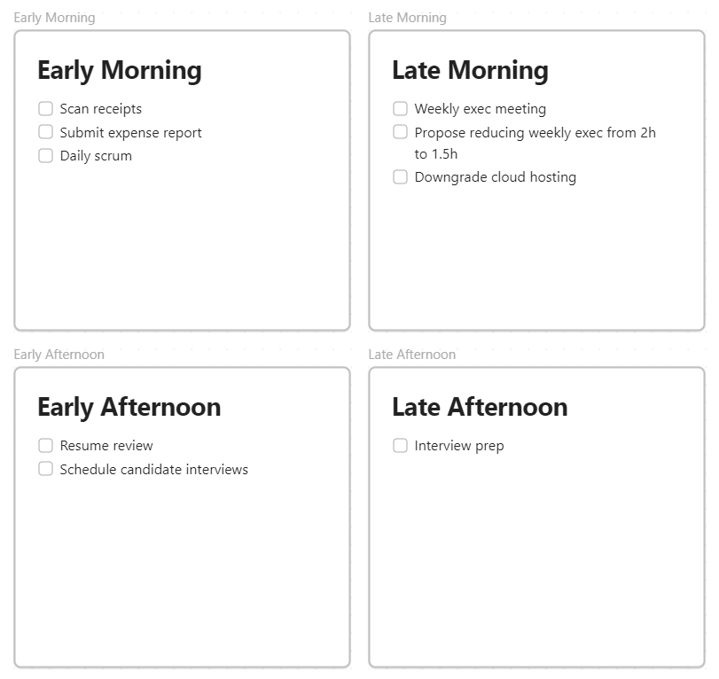
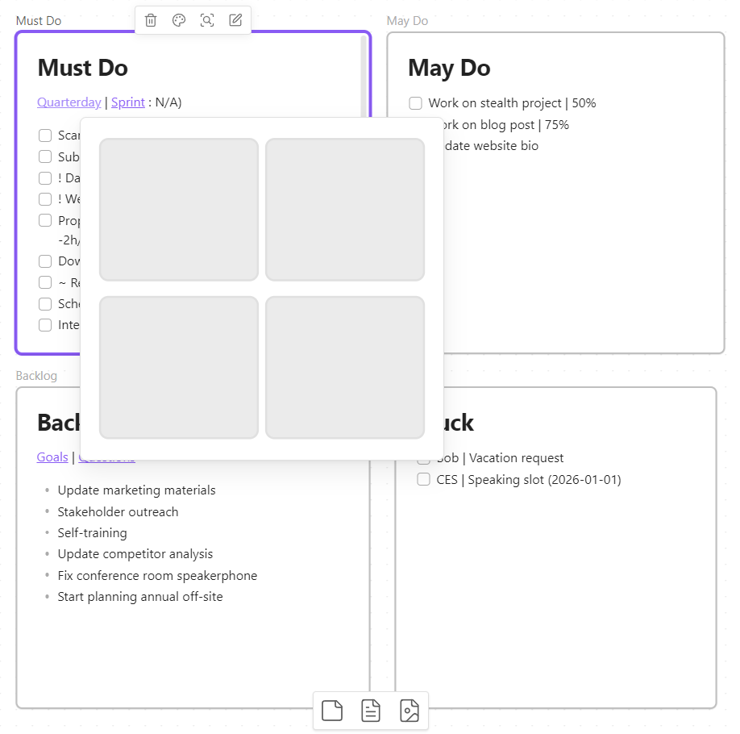

# Quarterday

There's planning and then there's execution, and if you've ever had a daunting number of context-varied tasks to accomplish, you know it's tough sometimes to just sit down and chunk through the work. Quarterday is a workflow I use to make the job more manageable. It's a visual approach of establishing not just "what do I need to do today" but "how can I move quickly, avoid distraction, and not over-invest in some things to the detriment of others."

Quarterday looks at work through two frames of reference: the "big picture," in which you isolate those tasks that you want to tackle today, and the "small picture," in which you distribute those tasks across four equal blocks of time. The result is eight separate task lists, which sounds like taking a tank to the corner store. In fact, it's a reduction in complexity through clarity of visualization, much like a Kanban. You don't really need a Kanban to track task progression: you could just as easily use a long linear list... but in a Kanban the columnar left-to-right visualization helps you instinctively understand what's happening now and what needs to happen next.

## The Big Picture: Thinning the Backlog

The big picture will be familiar to anyone who's practised Agile project management. There are four quadrants for any given day: Must Do, May Do, Backlog and Stuck. In general, it's desirable for tasks to be as atomic as possible because our goal is unambiguous completion. So while it's fine to have "work on project" in the Backlog or even in the May Do list, it's just too vague for the Must Do list and should be broken down into specific tasks which can be definitively completed. That said, a task which takes less than a few minutes and is mostly muscle memory doesn't need to clutter up your tasking (e.g. turn on your laptop).

- **Must Do.** These are granular tasks which are achievable by the end of the day. Our goal is to unambiguously get these done.
- **May Do.** These are stretch tasks which can be tackled if you get through the Must Do list with time remaining on the clock. Tackling May Do tasks can keep them off tomorrow's Must Do list, although technically May Do tasks can roll over indefinitely. (Practically, if a May Do task keeps rolling over into tomorrow, it's probably a sign that it belongs in the Backlog.)
- **Backlog.** This is a comprehensive list of everything you might want to tackle at any point in the future, at any level of specificity. The reason it's fine to have vaguely defined tasks in the Backlog is that it's good to start thinking about tasks early. You'll note that in the screenshot, Must Do and May Do tasks are depicted as checkboxes but Backlog tasks are depicted as bullets; this is because a task in the Backlog needs to be promoted to Must Do or May Do before being worked on.
- **Stuck.** These are tasks which cannot progress because of external obstacles. The information we try to capture here is who's responsible for what and when. In Agile scrum terminology, these are simply called blockers.

It's strongly recommended that tasking be done at the beginning of the day (and if it's a significant effort, it may even be represented as the first task in your list). Once a task list is fixed, however, it should remain unchanged at the big picture level for the remainder of the day, since retroactively assessing your early optimism or pessimism can be insightful. See the note below on perishability to figure out how much attention to pay to performance.

## The Small Picture: Quarterday

The small picture is a visualization of your day, separated into four blocks: Early Morning, Late Morning, Early Afternoon and Late Afternoon. If you work a night shift, these will obviously be different, but in a traditional 8-hour workday, these can be thought of as four 2-hour blocks:

- Early Morning: 8:00am to 10:00am
- Late Morning: 10:00am to Noon
- Early Afternoon: 1:00pm to 3:00pm
- Late Afternoon: 3:00pm to 5:00pm

This breakdown allows for an hour off in the middle of the day for lunch, and although not depicted it's prudent to take short breaks in the morning and afternoon (generally every hour or prior to a new task that requires context switching).

Although I've discouraged you above from manipulating big picture tasking in the middle of the day, it's fine to change small picture tasking at any point; in fact, because time estimation is tough for everyone, you should expect that you may sometimes start early on the next block's tasks, or, less optimally, have to move an unfinished task to a later block.

As you complete tasks at the small picture level, go ahead and update the big picture, but it's also fine to wait until the end of the day to sync the big picture retroactively. The important thing is that you actually update the big picture so that you have an accurate view of what remains to be accomplished tomorrow.

## Tooling

Doesn't matter. If you use Notion, go for it. If you still use Trello, (a) why? but (b), go for it. If you use Google Keep, and it hasn't been decommissioned in the few seconds it took to read this sentence, go for it. The tooling honestly doesn't matter. Full disclosure, I started using this model with a pen and a piece of graph paper that I creased into quarters.

## Fully Loaded ##

Certain task management systems will allow you to categorize, nest or annotate tasks, all of which can be helpful for prioritization or visual clarity. I use a lightweight form of annotation called [NUB Task Notation](https://github.com/timothyquinn/NUB-Task-Notation) to make prioritization easier.

From the big picture view, you can incorporate myriad other types of list data, from broad organizational or personal goals, to questions that need answering prior to tasking, to sprints for aligning tasks with code releases of higher level themes. Whatever helps you better parse your tasking environment is fine, with the caveat that the more complicated the model appears, the less useful it will likely be.

## A Note on Perishability

I find I've adopted a perishable attitude to tasking: once the day is done, I delete any completed tasks and replace with new tasks, overwriting yesterday with the plan for today. I understand that others may prefer to preserve completed tasks and iteratively record their accomplishments for long-term performance analysis. (If this is you, allow me to gently suggest it's time to get rid of those Moleskine notebooks from 2010.)

For me, retention takes away from the simplicity of the model, and it risks replacing an efficacy mindset with an efficiency mindset. But neither attitude is inherently wrong. Use the model as you see fit.
